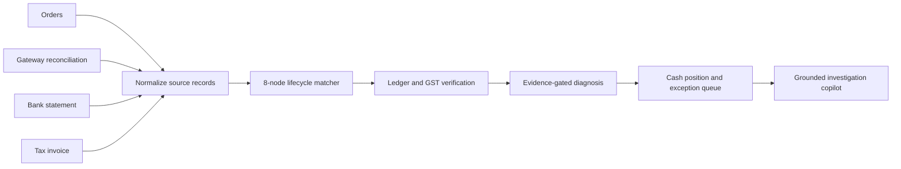

# AI Finance Controller

An audit-safe reconciliation copilot for a finance-operations close. It ingests a batch of orders, gateway reconciliation data, bank credits, and tax invoices; links the lifecycle; verifies books and cash; explains exceptions; and abstains when the evidence is not sufficient.

## What it closes



The deterministic reconciliation and financial calculations remain authoritative. The copilot explains evidence and recommends a next investigation step; it never posts a journal, approves a settlement, or creates a financial action.


## Benchmark results

The bundled benchmark contains a 60-case development batch and a separately generated 120-case holdout batch. Each anomaly class has at least ten holdout examples; every miss is retained with its predicted cause, outcome, and evidence gap in `outputs/holdout/metrics_report.json`.

| Measure | Development | Holdout |
|---|---:|---:|
| Cases / source records | 60 / 626 | 120 / 1,241 |
| Top-1 root-cause accuracy | 98.3% (59/60) | 97.5% (117/120) |
| Macro-F1 | 98.3% | 97.5% |
| Correct abstentions | 25 | 38 |
| False confident answers | 0 | 2 |
| Abstention rate | 41.7% | 31.7% |
| Case linkage | 100% | 100% |

### Holdout miss analysis

The 120-case holdout produced 3 diagnosis misses:

- 2 `AMOUNT_DRIFT` cases were confidently classified as `SOURCE_CONFLICT`; these require rule refinement for competing evidence.
- 1 `FEE_MISSING` case correctly abstained due to insufficient evidence, but did not recover the correct root cause.

Overall holdout accuracy was 97.5% (117/120), with all cases successfully linked to a lifecycle case.

“Case linkage” means records were assigned to a lifecycle case. It is deliberately distinct from a clean reconciliation: node-level ambiguity and unmatched records remain visible and feed the exception queue. Accuracy is calculated as correct top-1 diagnosis divided by all evaluated cases; macro-F1 weights each anomaly class equally.


## Supported root causes
## Glossary

- **RCH (Root-Cause Hypothesis):** A candidate explanation for why expected and actual financial states diverge.
- **FOD (First Observed Divergence):** The earliest lifecycle point where expected and actual state disagree.
- **OC (Observed Cause):** The ground-truth anomaly type injected into a test case.
- **CH (Cause Hypothesis):** The candidate root-cause class used to evaluate diagnosis.

- Missing fee record
- Duplicate payment webhook
- Incorrect GST calculation
- Provenance or timestamp skew
- Amount drift
- Settlement delay against the payment-method SLA
- Split-settlement misattribution
- Conflicting source values
- Orphaned refund

## Run it

### Docker

```bash
docker-compose up
```

Open `http://localhost:8000/report.html`.

### Windows PowerShell

```powershell
pip install -r requirements.txt
.\run.ps1
```

The script generates both benchmarks, writes the report to `outputs/report.html`, and serves it at `http://localhost:8000/report.html`.

### Tests

```bash
pytest -q
```

Tests include end-to-end guards from anomaly injection through ingest, matching, evidence, and diagnosis for every supported root cause.


## What this does not yet solve

- The supplied benchmark is synthetic; production deployment needs versioned source contracts, authentication, retention controls, and observed merchant data.
- The dashboard actions are explicitly demo-only workflow signals; they do not persist assignments or modify books.
- The copilot uses a local grounded responder. A production LLM integration would need policy controls, evaluation, and tenant isolation.
- The system detects exceptions but does not automatically release, reverse, or settle money.
